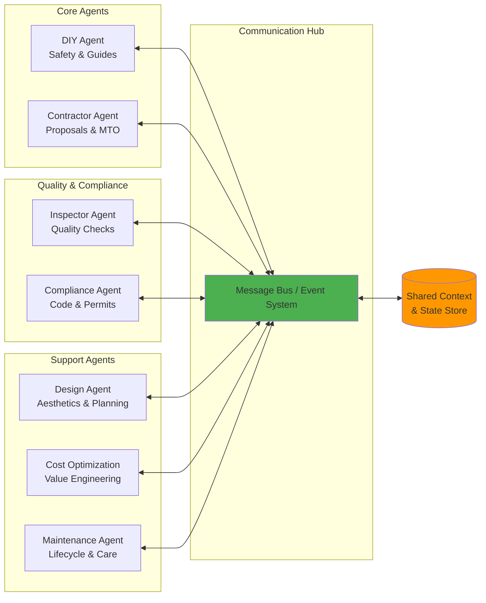
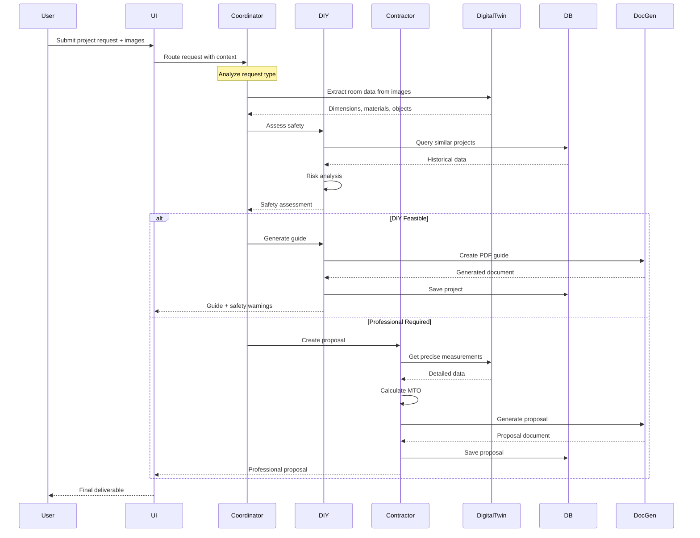
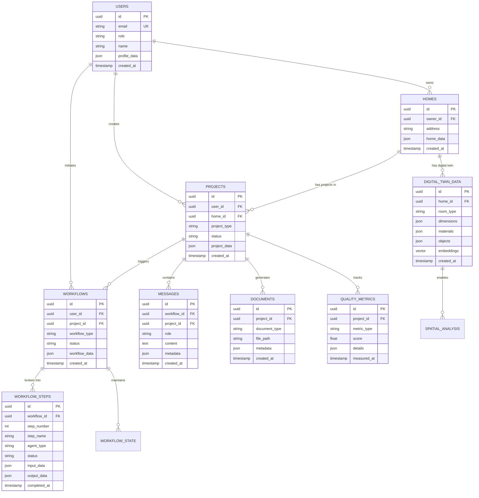
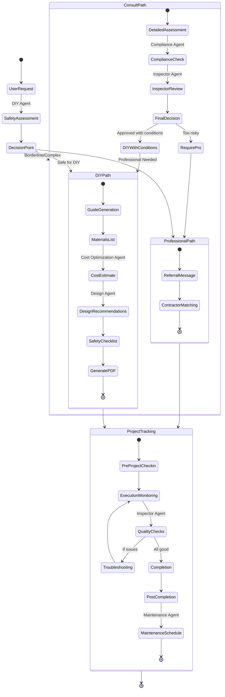
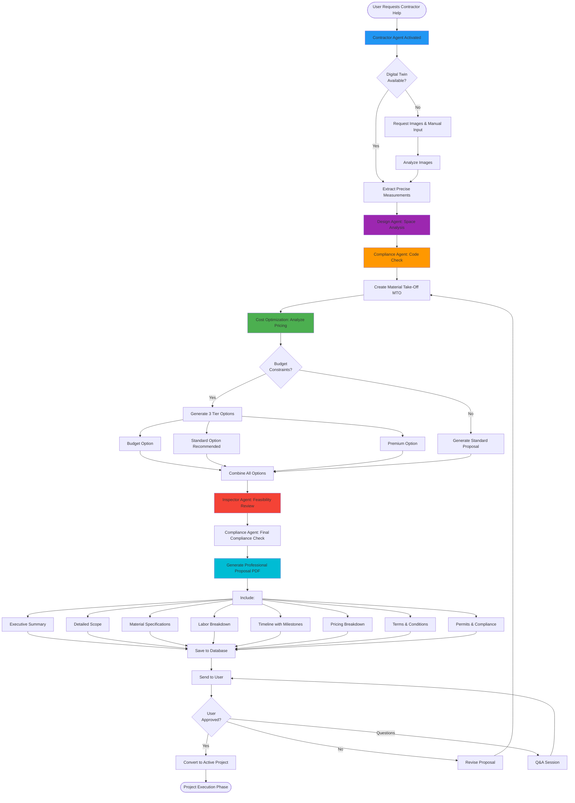
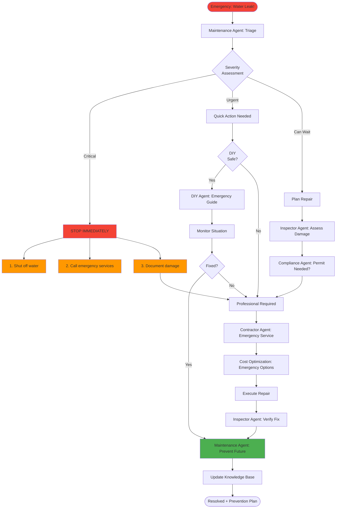

# HomerView AI System Architecture & Workflows
## Complete Visual Guide to System Integration

**Version**: 1.0  
**Last Updated**: 2025-01-27

---

## Table of Contents
1. [High-Level System Architecture](#1-high-level-system-architecture)
2. [Agent Ecosystem & Communication](#2-agent-ecosystem--communication)
3. [Data Flow Architecture](#3-data-flow-architecture)
4. [Database Schema & Relationships](#4-database-schema--relationships)
5. [End-to-End Workflow Diagrams](#5-end-to-end-workflow-diagrams)
6. [Integration Points](#6-integration-points)
7. [Technology Stack](#7-technology-stack)

---

## 1. High-Level System Architecture

```mermaid
graph TB
    subgraph "Frontend Layer"
        UI[Streamlit UI]
        WebApp[Web Application]
    end
    
    subgraph "Orchestration Layer"
        Coordinator[Coordinator Agent]
        WorkflowEngine[Workflow Engine]
    end
    
    subgraph "Agent Layer - Core"
        DIY[DIY Agent]
        Contractor[Contractor Agent]
        Inspector[Inspector Agent]
        Compliance[Compliance Agent]
    end
    
    subgraph "Agent Layer - Specialized"
        Design[Design Agent]
        CostOpt[Cost Optimization Agent]
        Maintenance[Maintenance Agent]
    end
    
    subgraph "Service Layer"
        ImageGen[Image Generation Service]
        DocGen[Document Generation Service]
        DigitalTwin[Digital Twin Service]
        Marketplace[Marketplace Integration]
    end
    
    subgraph "Data Layer"
        DB[(PostgreSQL + pgvector)]
        Storage[File Storage]
        Cache[Redis Cache]
    end
    
    subgraph "External Integrations"
        Gemini[Google Gemini AI]
        LangSmith[LangSmith Tracing]
        PriceAPI[Price Comparison APIs]
        MapsAPI[Google Maps API]
    end
    
    %% Frontend connections
    UI --> Coordinator
    WebApp --> Coordinator
    
    %% Orchestration connections
    Coordinator --> DIY
    Coordinator --> Contractor
    Coordinator --> Inspector
    Coordinator --> Compliance
    Coordinator --> Design
    Coordinator --> CostOpt
    Coordinator --> Maintenance
    
    WorkflowEngine --> Coordinator
    
    %% Agent to Service connections
    DIY --> ImageGen
    DIY --> DocGen
    DIY --> DigitalTwin
    
    Contractor --> ImageGen
    Contractor --> DocGen
    Contractor --> DigitalTwin
    
    Design --> ImageGen
    Design --> DigitalTwin
    
    CostOpt --> Marketplace
    CostOpt --> PriceAPI
    
    %% Service to Data connections
    ImageGen --> Storage
    DocGen --> Storage
    DigitalTwin --> DB
    Marketplace --> Cache
    
    %% All agents to data
    DIY --> DB
    Contractor --> DB
    Inspector --> DB
    Compliance --> DB
    Design --> DB
    CostOpt --> DB
    Maintenance --> DB
    
    %% External integrations
    DIY --> Gemini
    Contractor --> Gemini
    Design --> Gemini
    
    DIY --> LangSmith
    Contractor --> LangSmith
    
    Marketplace --> PriceAPI
    DigitalTwin --> MapsAPI
    
    style Coordinator fill:#4CAF50
    style WorkflowEngine fill:#4CAF50
    style DIY fill:#2196F3
    style Contractor fill:#2196F3
    style DB fill:#FF9800
    style Gemini fill:#EA4335
    style LangSmith fill:#673AB7
```



---

## 2. Agent Ecosystem & Communication

### 2.1 Agent Communication Patterns



### 2.2 Agent Handoff Patterns

```
┌─────────────────────────────────────────────────────────────┐
│                    AGENT HANDOFF FLOW                       │
└─────────────────────────────────────────────────────────────┘

User Request
     │
     ▼
┌─────────────────┐
│  Coordinator    │ ◄─── Routes to appropriate agent
└────────┬────────┘
         │
         ├──────► DIY Agent
         │           │
         │           ├── Assessment: DIY Feasible? ──► YES ──► Generate Guide
         │           │                                          │
         │           └── Assessment: Professional? ─► NO ───┐  │
         │                                                   │  │
         ├──────► Contractor Agent ◄─────────────────────────┘  │
         │           │                                           │
         │           ├── Create MTO                              │
         │           ├── Generate Proposal                       │
         │           └── Timeline Planning                       │
         │                    │                                  │
         ├──────► Inspector Agent ◄────────────────────────────┤
         │           │                                           │
         │           ├── Pre-inspection                          │
         │           ├── Progress checks                         │
         │           └── Final verification                      │
         │                    │                                  │
         ├──────► Compliance Agent ◄───────────────────────────┤
         │           │                                           │
         │           ├── Code verification                       │
         │           ├── Permit requirements                     │
         │           └── Legal compliance                        │
         │                    │                                  │
         ├──────► Design Agent ◄──────────────────────────────┤
         │           │                                           │
         │           ├── Space planning                          │
         │           ├── Style recommendations                   │
         │           └── Material selection                      │
         │                    │                                  │
         ├──────► Cost Optimization ◄──────────────────────────┤
         │           │                                           │
         │           ├── Budget analysis                         │
         │           ├── Value engineering                       │
         │           └── Savings opportunities                   │
         │                    │                                  │
         └──────► Maintenance Agent ◄──────────────────────────┘
                     │
                     ├── Preventive schedule
                     ├── Diagnostics
                     └── Lifecycle planning

ALL AGENTS SHARE:
    - Project context
    - User preferences
    - Digital twin data
    - Historical decisions
    - Quality metrics
```

---

## 3. Data Flow Architecture

### 3.1 Information Flow Through System



### 3.2 Shared Data Context

```
┌───────────────────────────────────────────────────────────────┐
│                    SHARED DATA CONTEXT                        │
└───────────────────────────────────────────────────────────────┘

┌─────────────────────────────────────────────────────────────┐
│  Project Context (Shared by All Agents)                     │
├─────────────────────────────────────────────────────────────┤
│  • Project ID & Status                                      │
│  • User Profile (skill level, preferences, budget)          │
│  • Home Data (digital twin, room dimensions, materials)     │
│  • Images (before, during, after)                           │
│  • Timeline & Milestones                                    │
│  • Cost tracking                                            │
│  • Quality metrics                                          │
│  • Safety assessments                                       │
│  • Agent decisions & reasoning                              │
│  • Communication history                                    │
└─────────────────────────────────────────────────────────────┘
         │
         ├──► DIY Agent reads: safety history, user skill, guides
         ├──► Contractor Agent reads: measurements, materials, costs
         ├──► Inspector Agent reads: quality standards, checklists
         ├──► Compliance Agent reads: location, codes, permits
         ├──► Design Agent reads: preferences, style, constraints
         ├──► Cost Agent reads: budget, pricing, alternatives
         └──► Maintenance Agent reads: systems, schedules, issues

All agents WRITE back:
    • Decisions made
    • Recommendations
    • Warnings/concerns
    • Generated artifacts
    • Quality metrics
    • Next steps
```

---

## 4. Database Schema & Relationships



---

## 5. End-to-End Workflow Diagrams

### 5.1 Complete DIY Project Workflow



### 5.2 Contractor Proposal Workflow



### 5.3 Multi-Agent Collaboration Workflow

```
┌──────────────────────────────────────────────────────────────┐
│         MULTI-AGENT KITCHEN RENOVATION WORKFLOW              │
└──────────────────────────────────────────────────────────────┘

Phase 1: DISCOVERY & ASSESSMENT
════════════════════════════════════════════════════════════════
│
├─► [User] "I want to renovate my kitchen"
│       │
│       ▼
├─► [Coordinator] Analyze request → Route to agents
│       │
│       ├─► [Design Agent] (Parallel)
│       │       └── Space analysis
│       │       └── Style recommendations  
│       │       └── Layout options → OUTPUT: Design concepts
│       │
│       ├─► [Inspector Agent] (Parallel)
│       │       └── Pre-renovation inspection
│       │       └── Identify existing issues
│       │       └── Structural assessment → OUTPUT: Inspection report
│       │
│       ├─► [Compliance Agent] (Parallel)
│       │       └── Check local codes
│       │       └── Permit requirements
│       │       └── HOA restrictions → OUTPUT: Compliance checklist
│       │
│       └─► [Cost Optimization] (Parallel)
│               └── Budget analysis
│               └── Cost saving opportunities
│               └── ROI projections → OUTPUT: Budget framework
│
└─► [Coordinator] Synthesize all outputs → Phase 1 Report

Phase 2: DETAILED PLANNING
════════════════════════════════════════════════════════════════
│
├─► [Coordinator] Based on Phase 1, trigger detailed planning
│       │
│       ├─► [Design Agent] 
│       │       └── Finalize layout based on inspection & codes
│       │       └── Create detailed specifications
│       │       └── Material selections → OUTPUT: Final design specs
│       │
│       ├─► [Contractor Agent] ◄── Uses: Design specs, Inspection report
│       │       └── Create detailed MTO
│       │       └── Calculate labor hours
│       │       └── Timeline with dependencies → OUTPUT: Project plan
│       │
│       └─► [Cost Optimization] ◄── Uses: MTO, Design specs
│               └── Analyze contractor estimates
│               └── Identify alternatives
│               └── Create tiered options → OUTPUT: Cost analysis
│
└─► [Coordinator] Create comprehensive proposal → Present to user

Phase 3: EXECUTION PLANNING
════════════════════════════════════════════════════════════════
│
├─► [User] Approves proposal
│       │
│       ▼
├─► [Compliance Agent]
│       └── Submit permit applications
│       └── Schedule inspections
│       └── Prepare documentation → OUTPUT: Permit package
│
├─► [Contractor Agent]
│       └── Finalize timeline
│       └── Order materials (lead times)
│       └── Schedule trades → OUTPUT: Execution schedule
│
└─► [Maintenance Agent]
│       └── Document existing systems
│       └── Plan for new system maintenance
│       └── Create lifecycle docs → OUTPUT: Maintenance baseline

Phase 4: EXECUTION MONITORING
════════════════════════════════════════════════════════════════
│
├─► [Day 1] Demolition starts
│       │
│       ├─► [Inspector Agent] Daily quality checks
│       ├─► [Compliance Agent] Code compliance verification
│       └─► [Coordinator] Progress tracking
│
├─► [Day 3] Rough-in work
│       │
│       ├─► [Inspector Agent] Rough-in inspection
│       ├─► [Compliance Agent] Submit for official inspection
│       └─► [Contractor Agent] Adjust timeline if needed
│
├─► [Day 7] Installation
│       │
│       ├─► [Design Agent] Verify design intent
│       ├─► [Inspector Agent] Quality verification
│       └─► [Cost Optimization] Track budget adherence
│
└─► [Day 10] Finishing
        │
        ├─► [Inspector Agent] Final inspection
        ├─► [Compliance Agent] Final code approval
        └─► [Contractor Agent] Punch list completion

Phase 5: COMPLETION & HANDOFF
════════════════════════════════════════════════════════════════
│
├─► [Inspector Agent] 
│       └── Final walk-through
│       └── Quality certification
│       └── Warranty documentation → OUTPUT: Completion certificate
│
├─► [Maintenance Agent]
│       └── Create maintenance schedule
│       └── System operation training
│       └── Lifecycle expectations → OUTPUT: Maintenance plan
│
├─► [Contractor Agent]
│       └── Final documentation
│       └── As-built drawings
│       └── Warranties collected → OUTPUT: Project closeout
│
└─► [Coordinator] Archive project → Knowledge base update

RESULT: Complete kitchen renovation with:
    ✓ Code compliant
    ✓ On-budget (tracked by Cost Optimization)
    ✓ Quality verified (Inspector Agent)
    ✓ Maintenance plan (Maintenance Agent)
    ✓ All documentation complete
```

### 5.4 Emergency Repair Workflow



---

## 6. Integration Points

### 6.1 External Service Integrations

```
┌──────────────────────────────────────────────────────────────┐
│                    INTEGRATION ARCHITECTURE                   │
└──────────────────────────────────────────────────────────────┘

┌─────────────────────────────────────────────────────────────┐
│  Google Gemini AI                                           │
│  ├─ Used by: DIY Agent, Contractor Agent, Design Agent      │
│  ├─ Purpose: Content generation, analysis, recommendations  │
│  └─ Data Flow: Text prompts → AI responses                  │
└─────────────────────────────────────────────────────────────┘
         │
         ▼
┌─────────────────────────────────────────────────────────────┐
│  LangSmith Tracing                                          │
│  ├─ Used by: All agents                                     │
│  ├─ Purpose: Observability, debugging, performance          │
│  └─ Data Flow: Agent actions → Traces → Analytics           │
└─────────────────────────────────────────────────────────────┘
         │
         ▼
┌─────────────────────────────────────────────────────────────┐
│  Digital Twin Service (3D Scanning)                         │
│  ├─ Used by: All agents needing measurements                │
│  ├─ Purpose: Precise room data, spatial analysis            │
│  └─ Data Flow: Images → 3D model → Measurements             │
└─────────────────────────────────────────────────────────────┘
         │
         ▼
┌─────────────────────────────────────────────────────────────┐
│  Price Comparison APIs                                      │
│  ├─ Used by: Cost Optimization Agent, Contractor Agent      │
│  ├─ Purpose: Real-time pricing, product availability        │
│  └─ Data Flow: Product query → Prices → Recommendations     │
└─────────────────────────────────────────────────────────────┘
         │
         ▼
┌─────────────────────────────────────────────────────────────┐
│  Document Generation (PDF)                                  │
│  ├─ Used by: DIY Agent, Contractor Agent                    │
│  ├─ Purpose: Professional document creation                 │
│  └─ Data Flow: Content + Templates → PDF documents          │
└─────────────────────────────────────────────────────────────┘
         │
         ▼
┌─────────────────────────────────────────────────────────────┐
│  Image Generation (Visualization)                           │
│  ├─ Used by: Design Agent, DIY Agent                        │
│  ├─ Purpose: Before/after visualization, design mockups     │
│  └─ Data Flow: Design specs → Generated images              │
└─────────────────────────────────────────────────────────────┘
         │
         ▼
┌─────────────────────────────────────────────────────────────┐
│  Google Maps API (Optional)                                 │
│  ├─ Used by: Contractor Agent, Compliance Agent             │
│  ├─ Purpose: Location data, contractor proximity            │
│  └─ Data Flow: Address → Location data → Jurisdiction       │
└─────────────────────────────────────────────────────────────┘
```

### 6.2 Data Exchange Formats

```json
// Standard Agent Input Format
{
  "request_id": "uuid",
  "timestamp": "ISO-8601",
  "user_id": "uuid",
  "project_id": "uuid",
  "agent_type": "diy|contractor|inspector|...",
  "action": "assess|generate|inspect|...",
  "context": {
    "user_profile": {
      "skill_level": "beginner|intermediate|advanced",
      "preferences": {},
      "budget": {}
    },
    "project_data": {
      "description": "text",
      "room_type": "kitchen|bathroom|...",
      "constraints": []
    },
    "digital_twin": {
      "dimensions": {},
      "materials": {},
      "objects": []
    },
    "images": [
      {
        "url": "string",
        "type": "before|current|reference",
        "metadata": {}
      }
    ],
    "previous_agent_outputs": []
  }
}

// Standard Agent Output Format
{
  "response_id": "uuid",
  "request_id": "uuid",
  "timestamp": "ISO-8601",
  "agent_type": "diy|contractor|...",
  "status": "success|warning|error",
  "confidence_score": 0.0-1.0,
  "output": {
    "primary_response": {},
    "recommendations": [],
    "warnings": [],
    "next_steps": []
  },
  "handoff": {
    "next_agent": "agent_type|null",
    "reason": "why handoff needed",
    "context_for_next": {}
  },
  "metadata": {
    "processing_time_ms": 0,
    "tokens_used": 0,
    "cost_estimate": 0.0
  }
}
```

---

## 7. Technology Stack

```
┌──────────────────────────────────────────────────────────────┐
│                     TECHNOLOGY STACK                         │
└──────────────────────────────────────────────────────────────┘

FRONTEND
═══════════════════════════════════════════════════════════════
├─ Streamlit (Current)
│   └─ Rapid prototyping, data-driven apps
│
└─ Future: React/Next.js
    └─ Production-ready web application

ORCHESTRATION & AGENTS
═══════════════════════════════════════════════════════════════
├─ LangChain
│   └─ Agent framework, chain orchestration
│
├─ LangSmith
│   └─ Tracing, debugging, observability
│
├─ LangGraph (Planned)
│   └─ Complex multi-agent workflows
│
└─ Custom Coordinator
    └─ Agent routing and workflow management

AI & ML
═══════════════════════════════════════════════════════════════
├─ Google Gemini 2.0 Pro
│   └─ Primary LLM for all agents
│
├─ pgvector
│   └─ Vector embeddings, semantic search
│
└─ Computer Vision (Planned)
    └─ Image analysis, object detection

BACKEND SERVICES
═══════════════════════════════════════════════════════════════
├─ Python 3.10+
│   └─ Core application language
│
├─ FastAPI (Planned)
│   └─ REST API endpoints
│
└─ Celery (Planned)
    └─ Background task processing

DATABASE & STORAGE
═══════════════════════════════════════════════════════════════
├─ PostgreSQL 15+
│   └─ Primary data store
│
├─ pgvector Extension
│   └─ Vector similarity search
│
├─ Redis (Planned)
│   └─ Caching, session management
│
└─ S3/Cloud Storage
    └─ Images, documents, generated files

DOCUMENT & IMAGE PROCESSING
═══════════════════════════════════════════════════════════════
├─ ReportLab
│   └─ PDF generation
│
├─ Pillow (PIL)
│   └─ Image processing
│
└─ ImageGen AI (Planned)
    └─ AI image generation for visualizations

INTEGRATIONS
═══════════════════════════════════════════════════════════════
├─ Google Maps API
│   └─ Location services
│
├─ Price Comparison APIs
│   └─ Material pricing
│
└─ Facebook Marketplace (Scraping)
    └─ Used items, contractor services

DEPLOYMENT
═══════════════════════════════════════════════════════════════
├─ Docker
│   └─ Containerization
│
├─ Docker Compose
│   └─ Local development orchestration
│
└─ Future: Kubernetes
    └─ Production scaling

MONITORING & LOGGING
═══════════════════════════════════════════════════════════════
├─ LangSmith
│   └─ Agent tracing
│
├─ Python Logging
│   └─ Application logs
│
└─ Future: DataDog/New Relic
    └─ Production monitoring
```

---

## 8. Implementation Roadmap

### Phase 1: Foundation (Current) ✅
- [x] DIY Agent with safety assessment
- [x] Contractor Agent with MTO generation
- [x] Document generation (PDF guides)
- [x] Database schema with PostgreSQL
- [x] Basic workflow orchestration
- [x] LangSmith integration

### Phase 2: Agent Expansion (Next 2-3 months)
- [ ] Inspector Agent implementation
- [ ] Compliance Agent with code database
- [ ] Design Agent with style recommendations
- [ ] Cost Optimization Agent
- [ ] Maintenance Agent
- [ ] Multi-agent workflow orchestration

### Phase 3: Advanced Features (3-6 months)
- [ ] Digital Twin integration (3D scanning)
- [ ] Real-time progress tracking
- [ ] Image generation for visualizations
- [ ] Advanced price comparison
- [ ] Contractor marketplace integration
- [ ] Mobile app development

### Phase 4: Scale & Optimize (6-12 months)
- [ ] Production deployment (Kubernetes)
- [ ] Advanced analytics & ML
- [ ] Predictive maintenance
- [ ] Community features
- [ ] API for third-party integrations
- [ ] International expansion

---

## 9. Key Design Principles

### 9.1 Agent Communication Principles

```
1. LOOSE COUPLING
   ├─ Agents communicate through message bus
   ├─ No direct dependencies between agents
   └─ Easy to add/remove/modify agents

2. SHARED CONTEXT
   ├─ All agents access shared project context
   ├─ Each agent contributes its expertise
   └─ Context evolves throughout workflow

3. ASYNCHRONOUS PROCESSING
   ├─ Agents can work in parallel
   ├─ Non-blocking operations
   └─ Efficient resource utilization

4. IDEMPOTENCY
   ├─ Same input → Same output
   ├─ Retryable operations
   └─ Crash-safe workflows

5. TRACEABILITY
   ├─ Every decision logged
   ├─ Full audit trail
   └─ Debuggable workflows
```

### 9.2 Data Flow Principles

```
1. SINGLE SOURCE OF TRUTH
   └─ Database as authoritative source

2. EVENT-DRIVEN ARCHITECTURE
   └─ State changes trigger agent actions

3. IMMUTABLE HISTORY
   └─ All decisions preserved

4. OPTIMISTIC CONCURRENCY
   └─ Handle concurrent operations gracefully

5. GRACEFUL DEGRADATION
   └─ System works even if some services unavailable
```

---

**End of System Architecture & Workflows Document**

For implementation details, see:
- `AGENT_PROMPTS_GUIDE.md` - Detailed agent prompts
- `WORKFLOW_EXAMPLES.md` - Workflow code examples
- `TECHNICAL_ARCHITECTURE.md` - Technical specifications
- `database/models.py` - Database schema implementation


